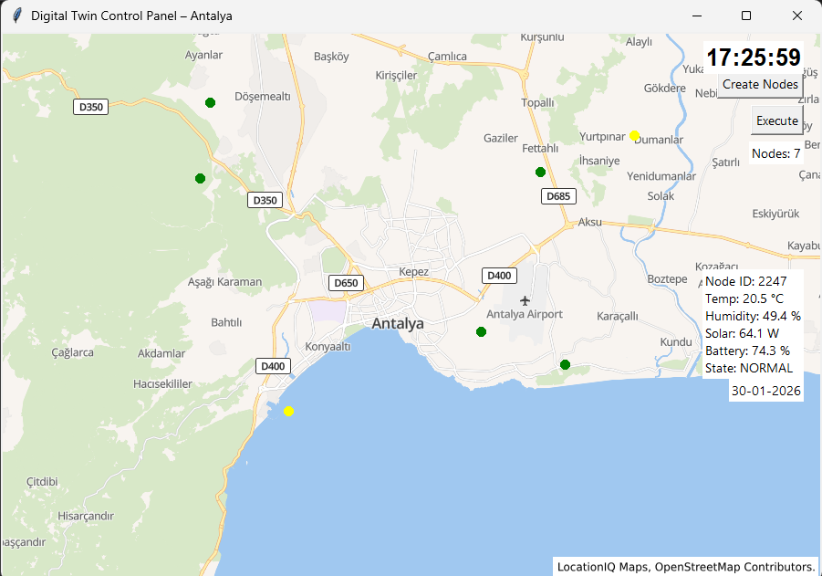

#  Digital Twin Control Panel

Bu proje, **2024 yılı Bilgisayar Ağları dersi** kapsamında geliştirilmiş,
temel seviyede bir **Digital Twin (Dijital İkiz)** uygulamasıdır.

Amaç, fiziksel bir ortamın dijital bir temsilini oluşturarak
veri izleme ve kontrol paneli mantığını öğrenmektir.

---

##  Projenin Amacı

- Digital Twin kavramını uygulamalı olarak öğrenmek
- API kullanımı ve ağ üzerinden veri çekme süreçlerini anlamak
- Python ile masaüstü bir kontrol paneli geliştirmek
- Bilgisayar Ağları dersinde istemci–sunucu mantığını pekiştirmek

---

##  Proje Kapsamı

Bu projede:

- Seçilen bir şehir/konum için çevresel veriler simüle edilmiştir
- Harita tabanlı görsel bir arayüz oluşturulmuştur
- API üzerinden veri çekme işlemleri gerçekleştirilmiştir
- Dijital ikiz mantığı temel seviyede uygulanmıştır

---

##  Kullanılan Teknolojiler

- **Python 3**
- **Tkinter** (Grafik arayüz)
- **Pillow (PIL)** – Görsel işlemler
- **Requests** – API veri çekme
- **OpenWeatherMap API**
- **Git & GitHub**

---
## 🖥️ Uygulama Arayüzü

Aşağıda Digital Twin uygulamasının çalışırken alınmış ekran görüntüsü yer almaktadır:

